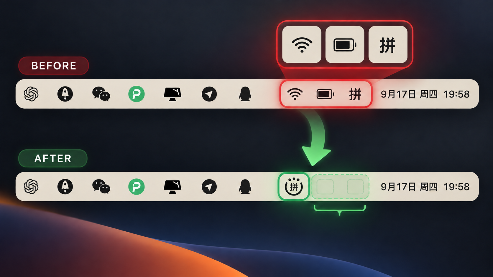
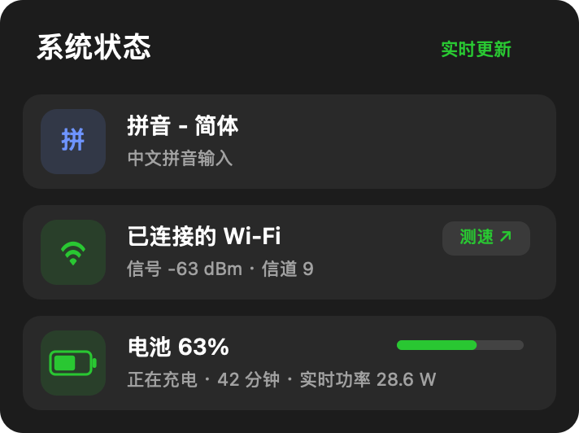
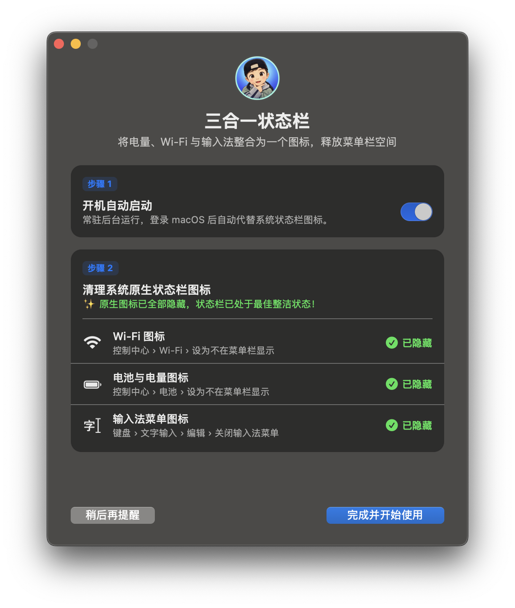

# mac duo 状态栏

<p align="center">
  
</p>

<p align="center">
  <strong>把三个状态，收进一个图标。</strong>
</p>

<p align="center">
  模仿 mac duo 的一体化交互思路，将输入法、Wi‑Fi 与电池状态巧妙融合，<br>
  收纳拥挤的 macOS 状态栏，让桌面重新变得清爽、克制而高效。
</p>


## 从拥挤到清爽

Wi‑Fi、电池、输入法不必再各占一个位置。mac duo 状态栏用一枚会随状态实时变化的图标，替代三枚系统图标：一个位置，三种状态，一次点击全部看清。



**使用前：** Wi‑Fi、电池与输入法各自占位，菜单栏越用越挤。

**使用后：** 三种状态融合成一枚 mac duo 图标，重要信息还在，空间却回来了。

## 为什么选择 mac duo 状态栏

- **三合一，真正省空间：** 输入法、Wi‑Fi、电池状态集中显示，告别图标排队。
- **一眼就懂：** 圆点代表 Wi‑Fi 信号，圆环代表剩余电量，中央字符跟随输入法变化。
- **细节会说话：** 充电闪电、低电量红色、VPN 绿色提示，都能在图标上即时反馈。
- **点击看全貌：** 一枚图标背后，输入法、网络、VPN、电量、充电时间与实时功率一目了然。
- **安静地融入 macOS：** 原生交互、自动启动、离开后自动收起，不打断你的工作流。

## 核心功能

- 一个图标同时显示输入法、Wi‑Fi 信号和电池余量。
- 两格 Wi‑Fi 时右侧圆点为空心；电量减少时圆环从右侧留空。
- 充电时显示闪电标记、预计充满时间和实时输入功率。
- 弹窗显示 Wi‑Fi、VPN、电池和当前输入法的详细状态。
- VPN 已连接时 Wi‑Fi 图标显示绿色。
- 点击“测速”打开节点测速页面。
- 鼠标离开后 3 秒自动收起弹窗。
- 首次启动提供原生状态栏图标隐藏向导，并自动检测完成情况。
- 支持登录时自动启动。
- Universal 2：同时支持 Apple Silicon 与 Intel Mac。

## 截图

| 状态面板 | 首次启动引导 |
| --- | --- |
|  |  |

## 系统要求

- macOS 13 Ventura 或更高版本
- Xcode Command Line Tools（仅从源码构建时需要）

## 安装

从仓库的 **Releases** 页面下载最新版 ZIP，解压后将 `三合一状态.app` 拖入“应用程序”文件夹并打开。

目前发布包采用本地签名，尚未经过 Apple Developer ID 公证。如果 Gatekeeper 阻止首次运行，请自行从源码构建，或仅在确认下载来源可信后通过“系统设置 → 隐私与安全性”允许打开。

## 从源码构建

```bash
git clone https://github.com/1362399368/UnifiedStatus.git
cd UnifiedStatus
chmod +x build.sh
./build.sh "$PWD/build/三合一状态.app" "$PWD/build/三合一状态.zip"
open "$PWD/build/三合一状态.app"
```

`build.sh` 会分别编译 `arm64` 与 `x86_64`，再合并为 Universal 2 应用。第二个参数为可选的 ZIP 输出路径。

## 使用方式

- 左键菜单栏图标：打开或关闭状态面板。
- 右键菜单栏图标：打开新手引导、切换登录启动、进入系统设置或退出应用。
- 第一次启动：根据引导隐藏系统自带的 Wi‑Fi、电池和输入法图标。

## 隐私

应用不包含分析、广告或账号系统，也不会上传 Wi‑Fi、电池、VPN 或输入法信息。所有状态读取都在本机完成。“测速”按钮只会在默认浏览器中打开第三方测速页面。

## 项目结构

- `App.swift`：状态读取、菜单栏图标、弹窗及交互。
- `Onboarding.swift`：首次启动引导、原生图标检测和登录启动管理。
- `Info.plist`：应用元数据与最低系统版本。
- `AppIcon.icns`：macOS 应用图标。
- `build.sh`：Universal 2 构建、签名与可选打包脚本。

## 参与贡献

欢迎提交 Issue 和 Pull Request。提交前请确认应用能同时通过 `arm64` 与 `x86_64` 构建。

## 许可证

[MIT License](LICENSE)
